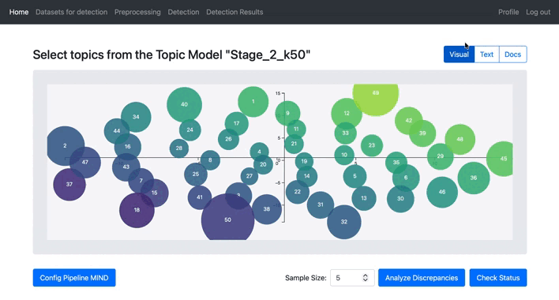

# MIND Web Application

MIND web application provides an intuitive and efficient interface for MIND's tools, enabling users to perform data preprocessing, topic modeling, and discrepancy analysis easily and effectively. It can be deploy the web application using the code from this repository to customize the web interface, or access the application online via a hosted URL (https://mind.uc3m.es), allowing full flexibility for personal use.

- [Deployment: Environment Configuration and Execution](#1-deployment-environment-configuration-and-execution)
- [Services Overview](#2-services-overview)
- [Web Application Sections](#3-web-application-sections)
   - [Home](#home)
   - [Sign Up](#sign-up)
   - [Login](#login)
   - [Profile](#profile)
   - [Datasets](#datasets)
   - [Preprocessing](#preprocessing)
   - [Detection](#detection)
   - [Detection Results](#detection-results)

## 1. Deployment: Environment Configuration and Execution

### Environment Files (`.env`)
The project contains three separate `.env` files, each corresponding to a core service: **auth**, **backend**, and **frontend**. These files must be created or edited inside their respective directories:

```
auth/.env
backend/.env
frontend/.env
```

Below are the variables you can modify in each service:

---

#### **[auth/.env](./auth/.env)**

```
DATABASE_URL=postgresql://auth_user:auth_pass@db:5432/auth_db
SECRET_KEY=XXXXXXXX
```
- `DATABASE_URL`: Connection string for the authentication database.
- `SECRET_KEY`: Secret key used for signing and securing authentication tokens.

---

#### **[backend/.env](./backend/.env)**
```
MAX_USERS_DETECTION=2
```
- `MAX_USERS_DETECTION`: Maximum number of users allowed to analyse contradictions in Detection's section simultaneously.

---

#### **[frontend/.env](./frontend/.env)**
```
WEB_APP_KEY="XXXXXXX"

MAX_CONCURRENT_TASKS=20
MAX_CONCURRENT_TASKS_PER_USER=4
```
- `WEB_APP_KEY`: API key used by the frontend to communicate securely with backend services.
- `MAX_CONCURRENT_TASKS`: Maximum number of tasks allowed globally.
- `MAX_CONCURRENT_TASKS_PER_USER`: Maximum concurrent tasks allowed per user.

---

### Run Web App

1. Navigate to the project root (where [`docker-compose.yml`](/docker-compose.yml) is located) and build the containers:

    ```bash
    docker compose build
    ```

2. Start the services in detached mode:

    ```bash
    docker compose up -d
    ```

3. Once started, the application will be accessible at the following ports:

- **frontend**: http://localhost:5050
- **auth service**: http://localhost:5002
- **backend**: http://localhost:5001
- **database (PostgreSQL)**: port 5444 mapped to 5432 in container.

---

## 2. Services
The application is composed of the following main services, each running in its own container:

- **auth (5002)**: Handles user authentication and account management.
- **backend (5001)**: Core processing service that handles dataset preprocessing and detection logic.
- **frontend (5050)**: Web interface that provides the user interface and communicates with backend services.
- **database (PostgreSQL, 5444:5432)**: Stores persistent data such as user accounts, session information, and metadata for datasets and tasks.

---

## 3. Web Application Sections

- ### Home
    Main landing page of the application. Contains a brief description of the project and an "About Us" section. From here, users can navigate to the main sections of the web application once logged in.


---

- ### Sign Up
    Registration page where new users can create an account. Users provide basic information such as name, email, and password. Once registered, they can log in to access the main application.


---

- ### Login
    Authentication page where existing users enter their credentials to access the application.


<p style="margin-left: 45px">After a successful login, users are redirected to the Home dashboard, which now displays user-specific content and navigation options for the main sections of the web application.</p>


---

- ### Profile
    The Profile section allows users to manage their personal account and datasets.

- **Dataset Management**: Users can upload new datasets, either raw data or previously preprocessed data by MIND.


- **User Information**: Users can update their personal information such as name, email, and password.


---

- ### Datasets
    This section displays all uploaded datasets as well as trained topic models. Users can preview the first 5 rows of each dataset, separated into raw data and preprocessed data.


---

- ### Preprocessing
    The Preprocessing section provides three main options:

1. **Preprocessing**: Convert raw data into preprocessed datasets (segmenting, translatind and data preparing) ready for topic modeling.
2. **Topic Model**: Create topic models using the preprocessed data.
3. **Data Download**: Download any dataset or trained topic model.

    This section allows users to fully prepare and manage their data and models for analysis.


---

- ### Detection
    The Detection section is divided into three main parts:

1. **Dataset and Model Selection**: Displays preprocessed datasets and, when expanded, shows associated trained topic models. Users select a specific model for analysis.


2. **Visual Topic Analysis and Discrepancy Configuration**: Provides a visual representation of topic distributions, including topic labels and document-topic distributions. Users can configure parameters for discrepancy analysis by selecting topics visually or via a list. Starting the analysis triggers alerts if the user leaves the page, and a pop-up allows checking the analysis status. Once completed, the user is redirected to the results table.

<p align="center">
  
</p>

3. **Results Table**: Shows a table where users can navigate, filter rows and tables, modify the `final_label` column, and update or download the table in XLSX format at any time.


---

- ### Detection Results
    This section presents the final results of the discrepancy analysis. Results are organized by the associated topic models, and users can expand each topic model to view the distinct topic sets that were analyzed.


